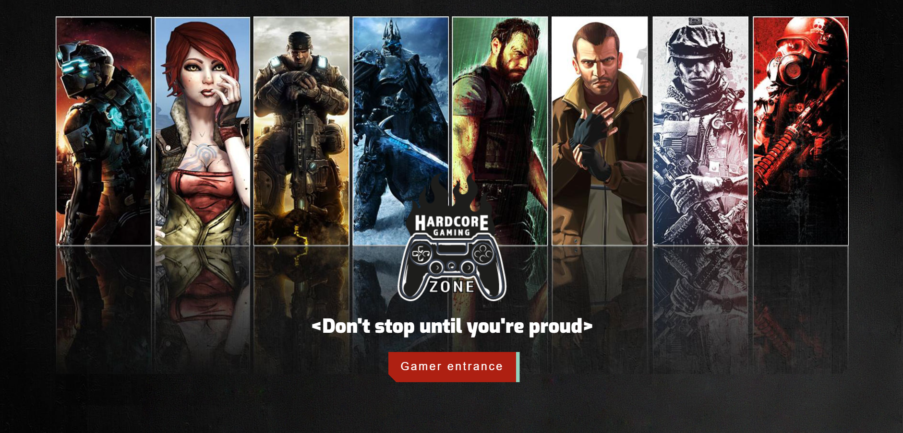

# Hardcore Gaming Zone - Videogames App

  

## 📝Description:

Development of a SPA (Single Page Application) using React for the Front End and Redux for managing states. This SPA consumes data from the RAWG API through a Back End developed in NodeJS using Express and Sequelize. It also allows you to create new video games in addition to editing and deleting them, storing them in a Postgres database. This application is 100% responsive and is made with CSS modules without the use of external libraries.

#### Used technologies:
- [ ] React
- [ ] Redux
- [ ] Express
- [ ] Sequelize - Postgres

#### Features

__Main page__: landing page with
- [ ] Designed background with css styles
- [ ] Button to enter the home (`Main route`)

__Main route__: contains
- [ ] Search input to find videogames by name
- [ ] Area where the list of videogames will be seen:
  - Image
  - Name
  - Genres
- [ ] Buttons/Options to filter by genre and by existing video game or added by us
- [ ] Buttons/Options to sort both ascending and descending the videogames by alphabetical order and by rating
- [ ] Paginated to search and display the following videogames, 15 games per page, showing the first 15 on the first page.

__Videogame detail path__: contains
- [ ] The fields shown in the main route for each videogame (image, name, and genres)
- [ ] Description
- [ ] Release date
- [ ] Rating
- [ ] Platforms

__Videogame creation route__: contains
- [ ] A form __controllled with JavaScript__ with the following fields:
  - Name
  - Description
  - Release date
  - Rating
- [ ] Ability to select/add multiple genres
- [ ] Ability to select/add multiple platforms
- [ ] Button/Option to create a new video game

__Videogame update route__: contains
- [ ] A form __controlled with JavaScript__ that updates the following fields of the videogames created:
  - Name
  - Description
  - Release date
  - Rating
- [ ] Ability to select/add multiple genres or delete
- [ ] Ability to select/add multiple platforms or delete
- [ ] Button/Option to create a new video game

__Videogame delete route__: contains
- [ ] A button in the created videogames detail that delete the game

> All forms are validate with Javascript
